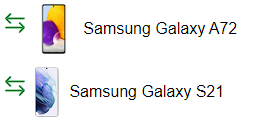
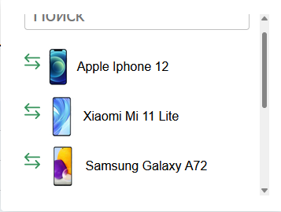
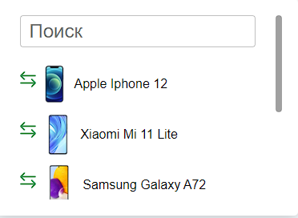

# Замечания
1. Где-то могут ехать изображения



Так как все они брались из оригинального проекта Figma, для большей схожести.

2. Scrollbar по разному выглядит в Firefox и Chrome



эту проблемму до конца я не победил

3. В колледже не уважают frontend, поэтому от греха подальше в проекте появилось api с привязкой к `posgreSQL`, как его запустить написанно ниже


# Как запустить проект

## Api и база данных.
1. Бэкапы базы данных `PostgreSQL` хранятся в папке `api/db-backup`. Выберите формат из которого было бы удобно восстанавлавать базу (формат бэкапа указан в названии файла) `db-backup-plain` или `db-backup-custom`
2. При необходимости настройте подключение к базе данных в соответствии с конфигурацией вашего `PostgreSQL`, открыв `api/db.js` и изменив параметры константы `pool`

```js
const pool = new Pool({
    user: 'postgres',
    host: 'localhost',
    database: 'phonesdb',
    password: '8800',
    port: 5432,
});
```

3. Запустите api командой

```
npm run start-api
```


## React приложение
Запустите приложение командой
```
npm run dev
```
